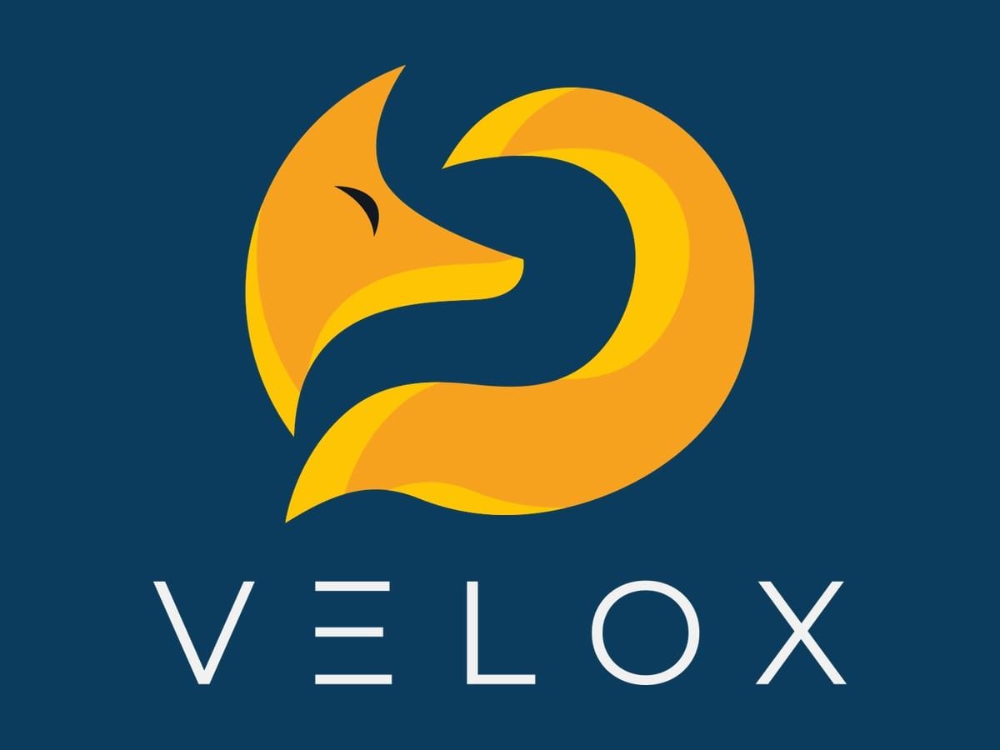
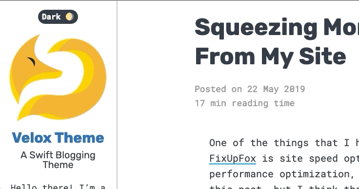

# Velox - A Mobile-First, WordPress Block Ready Theme

## Howdy

Hello there! I'm a WordPress theme based on the _s starter theme and turned into a theme for bloggers. I'm responsive and mobile first, and I was born to be friendly to the WordPress Block/Gutenberg Editor! 

I was named for [Vulpes velox](https://en.wikipedia.org/wiki/Swift_fox), better known as the Swift Fox. That's because I do my best to be fast for your site!

I also use [semantic HTML](https://developer.mozilla.org/en-US/docs/Glossary/Semantics#Semantics_in_HTML) and [microformats](http://microformats.org/) to make your site parse well for other services. More [IndieWeb](https://indieweb.org/) features are getting added over time!

## Features

I have several features ready to go to make your site unique to you. Just by using the WordPress Customizer you have access to the following:

### Colors
*  __Background Color__
*  __Text Color__
*  __Accent Text Color__ _(things like captions, citations, post meta, and entry footers)_
*  __Accent Color__ _(things like thematic breaks, block separators, buttons, and navigation and quote borders)_
* __Link Color__ _(also progress bar color)_
* __Link Active/Hover/Focus Color__
### Theme Settings
* __Font Pairing__ - I have four default font pairings so your content always looks good!
* __Dark Mode__ - Let visitors toggle dark mode to make the page darken for low-light reading. You can default to light mode, dark mode, or remove the toggle altogehter.
* __Read Time__ - Display an estimate for how long an article will take to read.
* __Article Progress Bar__ - Show a progress bar for how far you've scrolled in an article.
* __Author Info__ - Choose whether to display the author picture, display name, and description at the bottom of articles.

### Dark Mode

== Copyright ==

Velox Theme, Copyright 2020 DavidWolfpaw.com
Velox is distributed under the terms of the GNU GPL.

This program is free software: you can redistribute it and/or modify
it under the terms of the GNU General Public License as published by
the Free Software Foundation, either version 3 of the License, or
(at your option) any later version.

This program is distributed in the hope that it will be useful,
but WITHOUT ANY WARRANTY; without even the implied warranty of
MERCHANTABILITY or FITNESS FOR A PARTICULAR PURPOSE. See the
GNU General Public License for more details.

Velox bundles the following third-party resources:

* PrognRoll © 2016 Mehmet Burak Erman, MIT, https://mburakerman.com/prognroll/
* MicroModal © 2020 Indrashish Ghosh, MIT, https://micromodal.now.sh/
* Sticky-kit © 2015 Leaf Corcoran, MIT, https://leafo.net/sticky-kit/
* LibreFranklin-Bold.ttf: © 2015, Impallari Type, SIL Open Font License, 1.1
* SourceSerifPro-Regular.ttf: © 2014 Adobe Systems Incorporated, SIL Open Font License, 1.1
* Rubik-Bold.ttf: © 2015 The Rubik Project Authors, SIL Open Font License, 1.1
* RobotoMono-Regular.ttf: © 2015 Google Inc., Apache License, version 2.0
* Ovo-Regular.ttf: © 2011, Sorkin Type Co with Reserved Font Name "Ovo", SIL Open Font License, 1.1
* Muli-Regular.ttf: © 2016 The Muli Project Authors, SIL Open Font License, 1.1
* NixieOne-Regular.ttf: © 2011, Jovanny Lemonad with Reserved Font Name "Nixie", SIL Open Font License, 1.1
* LibreBaskerville-Regular.ttf: © 2012, Pablo Impallari, © 2012, Rodrigo Fuenzalida with Reserved Font Name Libre Baskerville, SIL Open Font License, 1.1

Bundled header image, Copyright David Wolfpaw
License: CC0 1.0 Universal (CC0 1.0)
